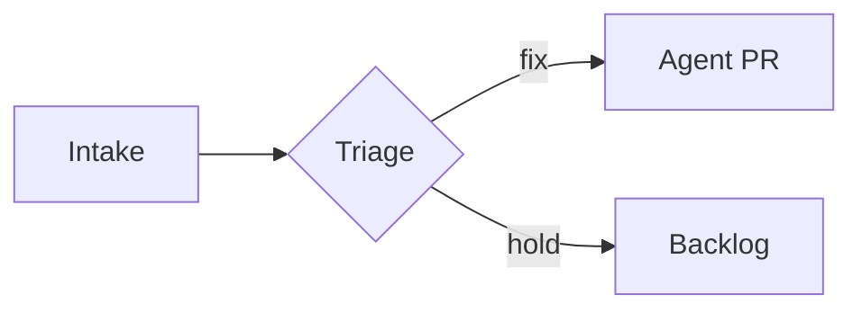

# Images and Diagrams

The house-style reference for embedding images and drawing diagrams in Markdown.
`SKILL.md` states the standing rules; this file carries the worked examples and
the renderer caveats. The "what renders where" matrix lives in
`renderer-compatibility.md`.

## Embedded images as base64 data URIs at the bottom of the file

This is a self-contained-document technique. The pattern keeps the large base64
blob out of the reading flow by using a Markdown reference-style image in the body
and placing the data-URI definition at the very bottom of the file.

In the body, where the image should appear:

```markdown
![Architecture overview][img-arch]
```

At the very bottom of the document, in a block of link reference definitions:

```markdown
[img-arch]: data:image/png;base64,iVBORw0KGgoAAAANSUhEUgAA...truncated...
```

Renderer reality, up front: data-URI images do not render on GitHub.com (GitHub
blocks the `data:` scheme in image sources). They render in VS Code native
preview, in browsers, and in pandoc or WeasyPrint HTML and PDF output. So this
pattern is for single-file documents that are read or rendered outside GitHub.

For an image that must render on GitHub, commit the image file into `assets/` and
reference it with a normal relative path:

```markdown

```

Generate the data-URI definition with the bundled scripts rather than by hand. The
scripts derive a default label from the file name, resolve the MIME type, base64
the bytes with no line wrapping, and emit both the in-body reference and the
bottom-of-file definition.

Bash:

```bash
scripts/encode-image-datauri.sh -i diagram.png -a "Architecture overview"
```

PowerShell:

```powershell
.\scripts\Encode-ImageDataUri.ps1 -Path diagram.png -Alt "Architecture overview"
```

To append the definition straight to the bottom of a document, pass the output
target (`-o` in Bash, `-OutFile` in PowerShell). Both scripts write the same
`[label]: data:<mime>;base64,<blob>` definition and the same `![alt][label]`
in-body usage hint.

## Diagrams

One default, two fallbacks, one hard prohibition.

### Default: Mermaid

GitHub renders a fenced `mermaid` block natively (since 2022), as do many editors
and docs platforms:

````markdown

````

Portability caveat: Mermaid renders on GitHub and in tools with Mermaid support,
but plain CommonMark renderers and some chat artifact surfaces show the raw code.
Recommend Mermaid as the default for diagrams in Markdown destined for GitHub.

### Fallback: SVG

Two forms, with different render rules:

- A committed `.svg` file referenced as a normal image renders on GitHub:

  ```markdown
  
  ```

- Inline `<svg>...</svg>` is HTML, audience-gated, and GitHub sanitizes most
  inline SVG, so it is unreliable there. It works in full HTML render contexts:

  ```markdown
  <svg viewBox="0 0 120 40" xmlns="http://www.w3.org/2000/svg">
    <rect x="2" y="2" width="116" height="36" rx="6" fill="none" stroke="currentColor"/>
    <text x="60" y="25" text-anchor="middle">Intake</text>
  </svg>
  ```

A base64 SVG data URI follows the same render rules as any data-URI image: it
works outside GitHub and does not render on GitHub.

### Prohibition: no ASCII diagrams

Do not draw diagrams as ASCII or box-drawing characters inside a fenced block.
Alignment drifts across fonts and renderers, agents reproduce them unreliably, and
they are inaccessible to screen readers. This is a firm rule. Route all diagram
needs to Mermaid or SVG.
